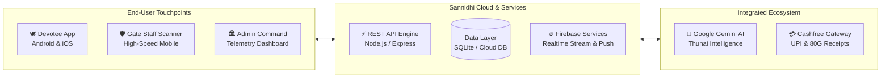

<div align="center">


# Sannidhi (சந்நிதி)
### The Intelligent Operating System for Sacred Temples & Pilgrimages

*Elevating the pilgrim journey with sub-second digital darshan passes, live crowd telemetry, bilingual AI assistance, and zero-trust temple gate verification.*

<br/>

[](https://github.com/Tectonic-s/Sannidhi/releases/tag/v2.0)
[](https://flutter.dev)
[](https://ai.google.dev)
[](https://nodejs.org)
[](https://www.cashfree.com)
[](LICENSE)

<br/>

<!-- HERO PRODUCT SHOWCASE -->
<p align="center">
  
</p>

</div>

---

## ⚡ The Modern Pilgrimage Dilemma & The Sannidhi Solution

Prominent heritage temples manage footfalls exceeding tens of thousands of daily visitors. Traditional management models lead to extreme physical wait times, gate congestion, forged passes, and communication breakdowns during peak festivals.

| The Legacy Experience | The Sannidhi Experience |
|:---|:---|
| ⏳ **Unpredictable 4-6 hour queues** in extreme weather | ⚡ **Guaranteed digital slots** with live crowd forecast charts |
| 🎟️ **Physical paper tickets** vulnerable to forgery | 🛡️ **Encrypted dynamic QR tokens** with anti-passback security |
| ❓ **Language & etiquette barriers** for visitors | 🤖 **Thunai AI (துணை AI)**: 24/7 bilingual spiritual concierge |
| 📢 **Delayed administrative emergency advisories** | 📡 **Instant push broadcasts** directly to all connected pilgrims |
| 💸 **Opaque cash queues** at temple hundi counters | 💳 **Instant digital E-Undiyal** with automated 80G tax receipts |

---

## 📱 Product Showcase

### 1. The Devotee Experience
> *Designed for serenity, ease of use, and multi-generational accessibility.*

<p align="center">
  
</p>

* **Smart Darshan & Seva Scheduling**: Reserve exact arrival windows for Dharma Darshan, Special Entry, Abhishekam, or Eco-Shuttle Hill transits.
* **Offline Dynamic Ticket Wallet**: Interactive carousel displaying cryptographically verifiable QR passes, slot countdowns, and devotee counts—available offline.
* **Daily Vedic Panchangam**: Real-time astrological timings including Tithi, Nakshatram, Rahu Kalam, Yamagandam, and auspicious festival notifications.
* **Elderly & High-Contrast Mode**: Single-tap toggle for 18pt+ typography, amplified touch targets, and high-visibility saffron palettes for senior devotees.

---

### 2. Thunai AI (துணை AI) — Personal Pilgrimage Concierge
> *Generative AI trained specifically for sacred traditions, rituals, and temple navigation.*

<p align="center">
  
</p>

* **Bilingual Intelligence**: Converse seamlessly in Tamil (தமிழ்) and English with deep contextual and cultural fluency.
* **Live Operational Guidance**: Instant answers regarding daily pooja schedules, prasad counters, dress codes, queue wait-times, and wheelchair availability.
* **Vedic Knowledge Engine**: Devotees can ask about the history, significance, and rituals of major festivals like *Thaipusam*, *Panguni Uthiram*, and *Karthigai Deepam*.

---

### 3. Real-Time Crowd Telemetry & Facility Locator
> *Transforming crowd congestion from a hazard into a predictable, smooth flow.*

<p align="center">
  
</p>

* **Hourly Crowd Forecaster**: Predictive chart showing historical and live visitor saturation to guide devotees toward quieter sanctum hours.
* **Interactive Campus Directory**: Categorized map directory pinpointing Annadhanam halls, medical aid, prasad distribution, cloakrooms, and battery car hubs.
* **Geofenced Arrival Triggers**: Automatic welcome greetings, etiquette guides, and active gate updates upon crossing the temple perimeter.

---

### 4. Gate Staff Verification & Anti-Passback Guard
> *High-throughput gate security built for peak festival surges.*

<p align="center">
  
</p>

* **Sub-Second QR Ingestion**: Powered by hardware-accelerated camera scanning for rapid entry validation.
* **Anti-Passback Enforcement**: Instantly detects and flags duplicate scans or expired passes with loud audio-visual confirmations (`ENTRY GRANTED`, `ALREADY USED`, `INVALID`).
* **Offline Resilience**: Continues validating entry passes even during intermittent hilltop network outages.

---

### 5. Temple Administrator Command Center
> *Complete campus observability and live crowd control in one central console.*

<p align="center">
  
</p>

* **Campus Saturation Gauges**: Real-time visualization of current sanctum occupancy, gate throughput rates, and queue velocity.
* **Emergency Push Broadcasts**: Instantly dispatch high-priority safety advisories, weather updates, or procession routes to thousands of devotee devices.
* **Festival & Seva Registry**: Effortlessly update darshan timings, special ticket quotas, and festival schedules in real time.

---

## 🏛️ System Architecture



---

## 🚀 Getting Started

### Download the App
Get the latest production release directly on your Android phone:

👉 **[Download Sannidhi v2.0 APK (Latest)](https://github.com/Tectonic-s/Sannidhi/releases/tag/v2.0)**

---

### Local Development Setup

#### 1. Clone the Repository
```bash
git clone https://github.com/Tectonic-s/Sannidhi.git
cd Sannidhi
```

#### 2. Start the Backend API
```bash
cd backend
npm install
npm start
```
*The local API will start on `http://localhost:5001`.*

#### 3. Run the Flutter App
```bash
cd ../sannidhi
flutter pub get
flutter run
```

---

## 📦 Production Build

To generate the production APK with automatic naming:

```bash
cd sannidhi
flutter build apk --release --no-tree-shake-icons
```
The output will be generated at:
```text
build/app/outputs/apk/release/Sannidhi-v2.0.apk
```

---

## 🤝 Contributing & Version Control
We maintain professional software engineering standards. All enhancements, bugfixes, and UI updates must go through dedicated feature branches:

1. Create a feature branch: `git checkout -b feature/your-feature-name`
2. Commit with conventional commit messages (`feat:`, `fix:`, `docs:`, `perf:`)
3. Open a Pull Request targeting `main`.

---

## 📄 License
This project is licensed under the **MIT License** — see the [LICENSE](LICENSE) file for details.

<div align="center">
  <br/>
  <b>Sannidhi (சந்நிதி) • Bridging Heritage and Innovation</b>
</div>
