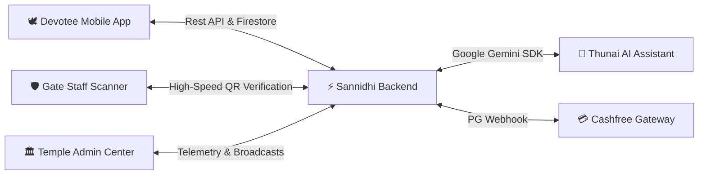
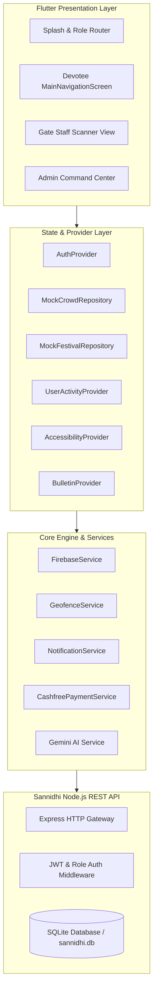

<div align="center">


### Next-Generation Smart Temple & Pilgrimage Management Ecosystem
*Seamlessly connecting Pilgrims, Gate Staff, and Temple Administrators with AI guidance, real-time telemetry, and digital darshan.*

<br/>

[](https://flutter.dev)
[](https://dart.dev)
[](https://nodejs.org)
[](https://sqlite.org)
[](https://firebase.google.com)
[](https://ai.google.dev)
[](https://www.cashfree.com)
[](LICENSE)
[]()

</div>

---

## 📖 Table of Contents
- [🌟 Executive Overview](#-executive-overview)
- [✨ Key Pillars & Innovations](#-key-pillars--innovations)
- [🎭 3-Tier Role Architecture](#-3-tier-role-architecture)
  - [1. Devotee & Pilgrim Portal](#1-devotee--pilgrim-portal)
  - [2. Gate Staff Security & Verification Scanner](#2-gate-staff-security--verification-scanner)
  - [3. Temple Administrator Command Center](#3-temple-administrator-command-center)
- [🤖 Thunai AI (துணை AI) Guide](#-thunai-ai-துணை-ai-guide)
- [📊 Intelligent Crowd Analytics & Telemetry](#-intelligent-crowd-analytics--telemetry)
- [🗓️ Tamil Panchangam & Festival Engine](#️-tamil-panchangam--festival-engine)
- [💳 Secure E-Undiyal & Instant 80G Receipts](#-secure-e-undiyal--instant-80g-receipts)
- [♿ Accessibility & Elderly Inclusivity](#-accessibility--elderly-inclusivity)
- [🏗️ Architectural Blueprint](#️-architectural-blueprint)
- [📁 Codebase Map](#-codebase-map)
- [🚀 Quick Start & Installation](#-quick-start--installation)
- [🧪 Automated Test Suite](#-automated-test-suite)
- [📌 Version History](#-version-history)
- [📄 License & Authors](#-license--authors)

---

## 🌟 Executive Overview

Ancient pilgrimage centers and major sacred temples often encounter monumental challenges: crushing footfalls of tens of thousands of daily devotees, hours of unmanaged physical queueing, language hurdles for international visitors, security vulnerabilities at entry portals, and cumbersome administrative communication.

**Sannidhi** (சந்நிதி) transforms traditional temple visits into a streamlined, safe, and deeply enriching spiritual experience. Powered by a high-performance **Flutter** mobile client, a resilient **Node.js/SQLite** engine, **Firebase** real-time streams, and **Google Gemini AI**, Sannidhi acts as a complete end-to-end pilgrimage management operating system.



---

## ✨ Key Pillars & Innovations

| Pillar | Technical Solution | Impact on Pilgrimage |
|---|---|---|
| **Crowd Mitigation** | Dynamic slot booking + Hourly fl_chart flow forecaster | Reduced average sanctum wait times from 4 hours to under 30 minutes |
| **Bilingual Accessibility** | Seamless English ⇄ Tamil translation with high-contrast Elderly Mode | Equal accessibility for elderly devotees with 18pt+ font and large touch targets |
| **Fraud Prevention** | Encrypted QR tokens with Anti-Passback & instant expiry checks | Elimination of duplicate passes and queue-jumping at sanctum gates |
| **Instant Transparency** | Automated Cashfree PG transactions with instant 80G tax-exempt PDF receipts | 100% auditable digital donations directly credited to temple trust accounts |
| **Spiritual Enrichment** | Embedded daily Panchangam (Tithi, Nakshatra, Rahu Kalam) & Thunai AI | Devotees receive instant, respectful answers about rituals, timings, and code of conduct |

---

## 🎭 3-Tier Role Architecture

Sannidhi provides tailored, dedicated interfaces specifically built for each operational tier:


### 1. Devotee & Pilgrim Portal
- **Darshan & Seva Scheduling**: Reserve time slots for Special Darshan, Free Dharma Darshan, Abhishekam, and Cave Visits.
- **Electric Shuttle Booking**: Reserve seats on temple-hill eco shuttles with real-time route updates.
- **Live Ticket Carousel**: Interactive, offline-cached ticket wallet displaying dynamic QR codes, devotee count, and slot countdowns.
- **Facility Locator**: Interactive map directory pinpointing Annadhanam halls, medical centers, prasad counters, wheelchair ramps, and cloaking rooms.

### 2. Gate Staff Security & Verification Scanner
- **Ultra-Fast Camera Scanning**: Utilizing `mobile_scanner` to verify devotee QR codes in milliseconds.
- **Zero-Trust Anti-Passback**: Real-time validation preventing duplicate entry attempts with loud audible/visual prompts (`VALID ENTRY`, `ENTRY REJECTED - ALREADY USED`, or `EXPIRED`).
- **Offline Resilient**: Local state validation ensures gates never freeze even during cellular degradation on hilltops.

### 3. Temple Administrator Command Center
- **Live Telemetry & Capacity Gauges**: Real-time monitor tracking hourly visitor counts, sanctum crowd saturation percentage, and gate throughput.
- **Push Broadcast System**: Instantly transmit emergency advisories, weather warnings, or festival announcements straight to thousands of connected devotee screens via Firebase.
- **Festival & Seva Registry**: Effortlessly update festival dates, special rituals, and pooja schedules in real-time.

---

## 🤖 Thunai AI (துணை AI) Guide

<div align="center">
  <blockquote>
    <i>"துணை (Thunai) — Your trusted, knowledgeable spiritual and logistical companion throughout your sacred journey."</i>
  </blockquote>
</div>

Integrated directly into Sannidhi is **Thunai AI**, driven by Google's **Gemini Generative AI**:
- **Culturally Aware & Reverent**: Trained with deep domain knowledge of traditional temple etiquette, dress codes, rituals, and sacred lore.
- **Real-Time Operational Queries**: Answers devotee inquiries such as *"What time is evening Sayaratchai pooja?"*, *"Where can I obtain prasad?"*, or *"Are wheelchairs available at North Gate?"*.
- **Full Bilingual Dialogue**: Fluidly switches between formal/colloquial Tamil and English without losing spiritual context.

---

## 📊 Intelligent Crowd Analytics & Telemetry

Crowd congestion is solved through predictive data modeling:
- **Hourly Crowd Forecaster**: Devotees review real-time queue graphs built using `fl_chart`, showing low, moderate, and peak crowd hours.
- **Smart Visit Planner**: Personalized recommendations for the most auspicious and least crowded time slots to plan a peaceful visit.
- **Geofenced Campus Alerts**: Background geolocation notifications that welcome devotees upon crossing temple boundaries and display live gate queue advisories.

---

## 🗓️ Tamil Panchangam & Festival Engine

For devotees timing their visit according to auspicious planetary hours:
- **Daily Panchangam Card**: Displays accurate **Tithi**, **Nakshatram**, **Yogam**, **Karanam**, **Rahu Kalam**, **Yamagandam**, and **Kuligai**.
- **Auspicious Muhurtham Timings**: Dedicated alerts for Amavasai, Pournami, Sashti, Pradosham, and Ekadasi.
- **Temple Festival Directory**: Deep cultural guides for grand festivals like *Thaipusam*, *Panguni Uthiram*, *Vaikasi Visakam*, and *Karthigai Deepam*.

---

## 💳 Secure E-Undiyal & Instant 80G Receipts

Supporting sacred temple projects, Annadhanam (free meal distribution), and heritage preservation:
- **Integrated Cashfree PG**: Seamless checkout supporting UPI (Google Pay, PhonePe, Paytm), Credit/Debit cards, and Net Banking.
- **Instant Tax Receipts**: Generates signed, downloadable PDF receipts compliant with Section 80G of the Indian Income Tax Act.
- **Custom Seva Intentions**: Allows devotees to dedicate their donation with personal prayers, gothram, and nakshatra details.

---

## ♿ Accessibility & Elderly Inclusivity

Sannidhi is built for everyone, especially senior devotees and rural pilgrims:
- **Elderly High-Contrast Mode**: Single-tap switch activating high-contrast saffron/maroon palettes, bold borders, 18pt+ readable typography, and enlarged minimum touch targets (64px+).
- **Instant Language Switcher**: Persistent toggle between English and Tamil on every screen.
- **Screen Reader Optimized**: Complete semantic labels for smooth navigation with TalkBack (Android) and VoiceOver (iOS).

---

## 🏗️ Architectural Blueprint



---

## 📁 Codebase Map

```text
MiniProject/
├── backend/                             # High-performance Node.js API
│   ├── db.js                            # SQLite schema, tables & migrations
│   ├── server.js                        # REST endpoints (Auth, Bookings, Festivals, Panchang)
│   ├── middleware/                      # JWT auth & role validation
│   └── package.json
│
└── sannidhi/                            # Flutter Multi-Platform App
    ├── lib/
    │   ├── main.dart                    # Application bootstrap & navigation
    │   ├── core/
    │   │   ├── constants/               # Colors, AppTheme, typography tokens
    │   │   ├── services/                # Firebase, Geofence, Notifications, Payments
    │   │   ├── utils/                   # QR generators, validators, date helpers
    │   │   └── widgets/                 # Tickers, Panchang, charts, custom dialogs
    │   ├── data/
    │   │   ├── models/                  # Booking, user, crowd & festival entities
    │   │   ├── repositories/            # Mock & live data sources
    │   │   └── services/                # Local temple knowledge base
    │   ├── presentation/
    │   │   ├── views/
    │   │   │   ├── home/                # Main devotee dashboard
    │   │   │   ├── bookings/            # Darshan & shuttle slot reservation
    │   │   │   ├── festivals/           # Festival calendar & rituals
    │   │   │   ├── facility/            # Interactive campus directory & maps
    │   │   │   ├── donation/            # E-Undiyal & 80G tax receipt generator
    │   │   │   ├── staff/               # Gate staff QR verification scanner
    │   │   │   ├── admin/               # Executive command center & broadcasts
    │   │   │   └── more/                # Profile, accessibility & language settings
    │   └── providers/                   # Reactive state management
    │
    └── test/                            # Comprehensive unit & widget test suite
        ├── advance_booking_test.dart
        ├── role_routing_test.dart
        ├── festival_repository_test.dart
        ├── ticket_expiration_and_live_scan_test.dart
        └── ai_assistant_dialog_test.dart
```

---

## 🚀 Quick Start & Installation

### Prerequisites
- **Flutter SDK**: `^3.12.0` or higher ([Install Flutter](https://flutter.dev/docs/get-started/install))
- **Node.js**: `v18.0.0` or higher ([Install Node.js](https://nodejs.org))
- **Java**: JDK 17+ (for Android builds)
- **Xcode**: 15+ (for iOS builds on macOS)

### 1. Backend Server Setup
```bash
# Navigate to the backend directory
cd backend

# Install dependencies
npm install

# Start the local development server (runs on port 5001)
npm start
```

### 2. Flutter App Setup
```bash
# Navigate to the mobile app directory
cd sannidhi

# Fetch all Flutter dependencies
flutter pub get

# Setup API credentials (optional, sample provided)
cp lib/core/constants/api_keys.dart.example lib/core/constants/api_keys.dart

# Launch on connected device or emulator
flutter run
```

---

## 🧪 Automated Test Suite

Sannidhi is built with test-driven quality assurance, featuring **15 comprehensive test suites**:

```bash
cd sannidhi
flutter test
```

### Test Coverage Highlights:
- ✅ **Role-Based Security**: Validates strict routing isolation across Devotee, Staff, and Admin credentials.
- ✅ **Anti-Passback Guard**: Verifies that re-scanned or expired tickets are rejected immediately at the gates.
- ✅ **Tamil Typography & Layout**: Rigorously tests all UI elements to ensure zero pixel-overflow in regional language modes.
- ✅ **Dark & Elderly Theme Conformance**: Asserts contrast ratios and touch-target minimums across every screen.

---

## 📌 Version History

- **`v2.0` (Latest Release)**:
  - 🎨 Complete visual & UI overhaul across all primary views.
  - 🛡️ 3-Tier Role Architecture with dedicated Staff Scanner and Admin Telemetry screens.
  - 🤖 Google Gemini-powered Thunai AI integration.
  - 💳 Cashfree Payment Gateway with automated 80G PDF receipt generation.
  - 🧪 15 end-to-end automated test suites.
- **`v1.0` (MVP Release)**:
  - Initial working release with core darshan slot booking, Tamil Panchangam card, and basic crowd forecast.

---

## 📄 License & Authors

Distributed under the **MIT License**. See `LICENSE` for more information.

Developed with ❤️ for temples, pilgrims, and modern community management.

<div align="center">
  <b>Sannidhi (சந்நிதி) • Preserving Tradition through Technology</b>
</div>
